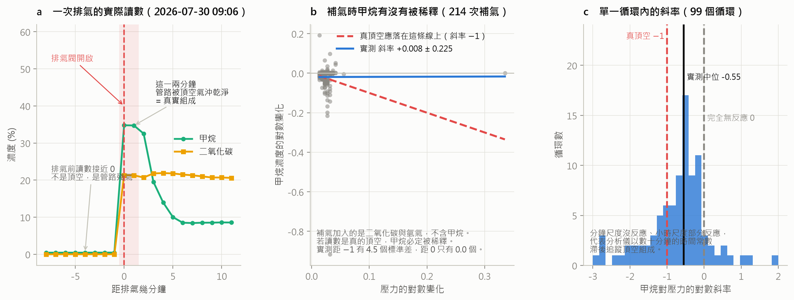
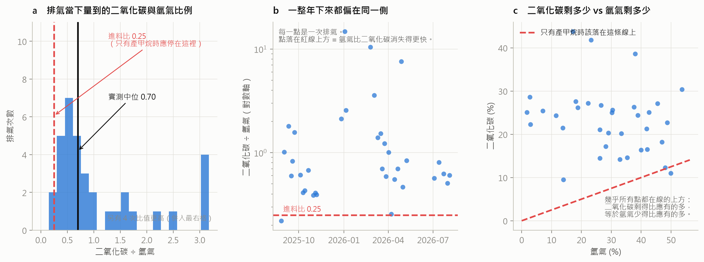
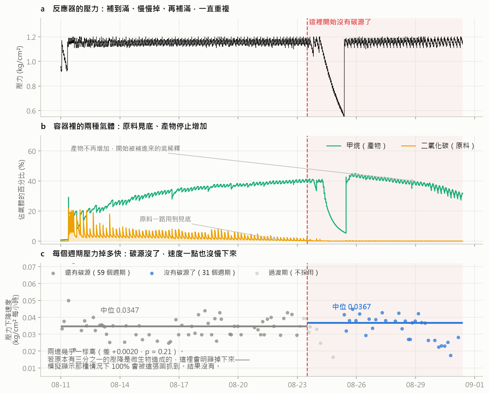
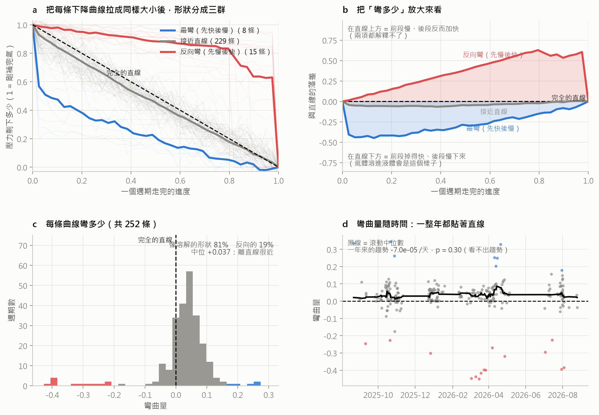
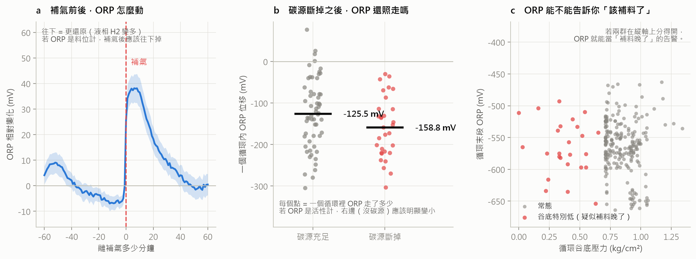
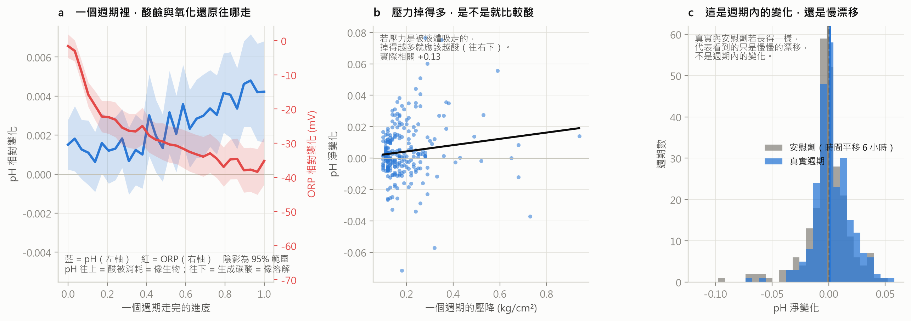
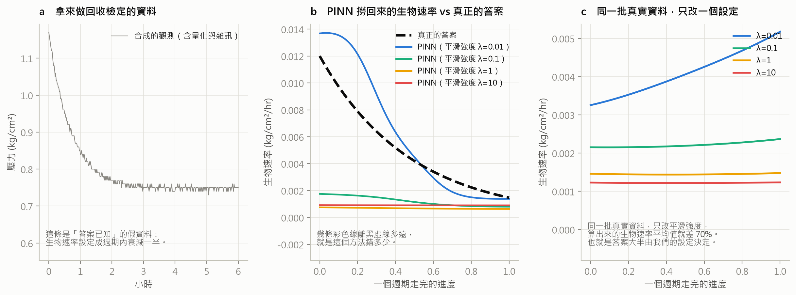

# 微加壓循環式生物甲烷化反應器：壓降歸因與氫氣質量平衡分析報告

| | |
|---|---|
| 報告日期 | 2026-09-21 |
| 分析對象 | 2025-08-04 至 2026-08-31 全部感測紀錄（去重後 341,013 筆） |
| 撰寫 | 李承育 |
| 適讀對象 | 設備與製程人員、後續接手分析者。**本報告假設讀者不熟悉統計方法，每個專有名詞在首次出現時均加以說明。** |

---

## 摘要

本報告回答一個核心問題：**反應器裡的壓力一直在下降，這些消失的氣體究竟去了哪裡？**

過去的解釋有兩個——被微生物轉換成甲烷（生物途徑），或是溶進液體裡（物理途徑）。
本次分析加入第三個可能，並且找到了它的直接證據。

**主要發現：氫氣正在以遠超過反應所需的速率消失。**

進料為二氧化碳比氫氣 1:4，這與產甲烷反應所需的比例完全相同。
因此若系統內只有產甲烷反應在進行，容器內剩餘氣體的二氧化碳對氫氣比例
應永遠維持在 0.25。**但 35 次排氣量測中有 34 次高於此值，中位數為 0.699，
即進料比的 2.79 倍**（統計檢定 p < 0.0001）。

這代表氫氣被額外移除了，而且量很大。此一發現同時解釋了先前三項互相矛盾的觀察：

1. 切斷碳源後，壓力仍以相同速率下降（因為消失的主要是氫氣，與碳源無關）
2. 氣體收支有一個長期對不起來的缺口
3. 壓降曲線幾乎是直線，顯示以定速移除為主（洩漏正是定速）

**次要發現**（方法學）：

- 氣體分析儀僅在排氣當下的一至二分鐘內讀得到真實組成，其餘時間為取樣管路的延遲訊號，
  不可用於定量。此點已由「補氣稀釋檢定」定量證實。
- 氧化還原電位（ORP）的絕對水準健康（−357 mV vs 標準氫電極，落在文獻最適區間內），
  但其在單一循環內的變化幾乎完全由氣泵開關與補氣動作造成，**不能當作微生物活性的即時指標**。
- 以物理資訊神經網路（PINN）反推隨時間變動的生物速率，在本案**不可辨識**：
  交叉驗證會系統性選到錯誤的設定。此結論已由「答案已知」的合成資料驗證。

**建議的優先處置**：先進行氫氣氣密性檢查，其餘分析方向在此之前均無法定案。

---

## 一、背景與待答問題

### 1.1 反應器如何運作

反應器內部上方為氣體空間（以下稱**頂空**），下方為含微生物的液體。
操作方式為：將二氧化碳與氫氣依 1:4 的比例充入頂空至約 1.17 kgf/cm²，
之後壓力會隨時間緩慢下降；當壓力降至約 0.92 kgf/cm² 時，控制器自動補氣至滿，
如此反覆。每一次「補滿到降低」的過程稱為一個**循環**。

氣泵會定時運轉，將頂空氣體打入液體中以增加接觸面積（稱為**氣液質傳**）。
實驗中曾設定每小時運轉 1、5、10 分鐘三種條件。

### 1.2 為什麼壓力下降的原因很重要

產甲烷反應為：

> **CO₂ + 4 H₂ → CH₄ + 2 H₂O（液態）**

氣相中消失 5 個分子、產生 1 個分子（水為液態），**淨減少 4 個分子**。
因此壓力下降是反應正在進行的表徵。

然而壓力下降也可能來自其他原因：氣體溶入液體、或是洩漏。
**若不能區分，則無法計算反應器的真實轉換效率，也無法判斷菌群狀態。**

### 1.3 先前分析遺留的三個矛盾

| 觀察 | 若壓降主要來自產甲烷，應該看到什麼 | 實際看到什麼 |
|---|---|---|
| 切斷碳源（二氧化碳）後 | 壓降速率應大幅下降 | 幾乎沒變（0.0347 → 0.0367） |
| 氣體總收支 | 消失的氣體應對應到甲烷產量 | 有一大段對不起來 |
| 壓降曲線形狀 | 應呈明顯彎曲（溶解的特徵） | 91% 幾乎是直線 |

本報告的分析即從解開這三個矛盾出發。

---

## 二、資料與方法

### 2.1 資料來源與前處理

原始資料為每分鐘一筆的感測紀錄（`BTP_Sensor_log-YYYY-MM-DD.csv`），
欄位依序為時間、氧化還原電位、酸鹼值、溫度、壓力、二氧化碳濃度、甲烷濃度。

**⚠ 去重處理**：現場的資料夾內容互相重疊（例如 `0813` 資料夾完整包含於
`0825-0831` 資料夾內）。若不去重，同一段下降會被重複計算，
所有速率與份額都會偏離，而且結果表面上看起來完全正常。
本次分析一律先依時間戳去除重複，合併後為 341,013 筆。

### 2.2 兩個必須避免的計算錯誤（本次分析中曾實際發生並已修正）

**(1) 消耗量不可用「所有負向變化加總」計算。**
壓力感測器的最小刻度為 0.01 kgf/cm²，讀數會在真值附近上下跳動。
把每一分鐘的下降全部加總，一小時就會累積出 0.11 的虛假消耗，
而實際速率僅約 0.03。正確做法是以補氣為界切出區段，
**消耗量 = 區段起始壓力 − 區段結束壓力**。

**(2) 酸鹼值不可用「頭尾各取中位數相減」計算。**
酸鹼值的最小刻度為 0.01，而單一循環內的總變化僅約 0.05（五個刻度）。
端點式的計算方式會被刻度壓成恰好 0.0000，產生「看起來沒有變化」的假結論。
正確做法是以整段資料做最小平方迴歸取斜率，再乘以時長；
數百個資料點平均後可解析到小於一個刻度的變化。

### 2.3 統計方法說明

- **置換檢定（permutation test）**：把資料標籤隨機打散數千次，
  看真實觀測值在這些「隨機結果」中有多極端。所得之 p 值即為
  「純屬巧合的機率」。p < 0.05 通常視為不太可能是巧合。
- **檢定力（statistical power）與最小可偵測效果（MDE）**：
  若一個檢定得到「沒有差異」的結論，必須同時說明
  「若真的有差異，這個檢定看得到嗎」。看不到的「沒有差異」不構成證據。
- **留一交叉驗證（leave-one-out cross-validation）**：
  每次留下一筆資料不參與計算，用其餘資料去預測它。
  這可以避免「用同一批資料又擬合又評分」造成的過度樂觀。
- **回收檢定（recovery test）**：先用已知答案合成假資料（並加入與現場相同的
  雜訊與刻度限制），再用待驗證的方法去計算，看算不算得回原本的答案。
  **算不回來的方法不得用於真實資料。**

---

## 三、結果

### 3.1 氣體分析儀只有在排氣當下可用

*圖 1　氣體分析儀的可用範圍。(a) 一次排氣的實際讀數；(b) 補氣時甲烷有沒有被稀釋；(c) 單一循環內的斜率分布。*

**檢定方式**：補氣所充入的是二氧化碳與氫氣，**不含甲烷**。
因此若分析儀讀的是真實頂空組成，補氣必然造成甲烷濃度被稀釋，
且稀釋幅度有嚴格的數學關係（甲烷濃度的對數變化應等於壓力對數變化的負一倍）。

**結果**（214 次補氣事件）：

| | 斜率 |
|---|---:|
| 真實頂空組成應有 | −1.000 |
| **實際量測** | **+0.008 ± 0.225** |
| 完全無反應（讀數與頂空脫節） | 0.000 |

實測值距「真實頂空」有 4.5 個標準差，距「完全無反應」僅 0.0 個標準差。
在單一循環內的迴歸斜率為 −0.551，顯示分析儀以數十分鐘的時間常數**滯後追蹤**頂空組成。

**結論**：分析儀在排氣瞬間（閥開啟後一至二分鐘，頂空氣體將取樣管路沖洗乾淨時）
所讀之值可信；其餘時間不可用於定量。全資料庫中符合此條件者共 **35 筆**。

> 此點與設備方的提醒一致：氣體偵測並非百分之百準確。
> 本報告後續所有涉及氣體組成的計算均僅使用這 35 筆。

### 3.2 ★氫氣正在超量流失（本報告最重要的發現）

*圖 2　排氣當下量到的二氧化碳與氫氣比例。(a) 分布；(b) 一整年的時序；(c) 二氧化碳剩餘量對氫氣剩餘量。紅色虛線為「只有產甲烷反應時應有的位置」。*

**原理**：設備方確認進料為二氧化碳比氫氣 **1:4**。
這恰好與產甲烷反應的消耗比例相同（CO₂ + 4 H₂）。
因此若系統內只有產甲烷反應：

- 補進去的是 1:4
- 消耗掉的也是 1:4
- **剩下的必然永遠是 1:4（比值 0.25），與轉換率高低無關**

比值偏離的方向即可直接診斷：

| 比值 | 意義 |
|---|---|
| 低於 0.25 | 二氧化碳被額外移除。二氧化碳的溶解度約為氫氣的 44 倍，**溶解屬於此類** |
| 等於 0.25 | 只有產甲烷反應 |
| **高於 0.25** | **氫氣被額外移除**（洩漏，或其他耗氫反應） |

**此檢定不需要任何校準常數，也不依賴壓力模型。**

**結果**（35 次排氣，已扣除 30 °C 飽和水蒸氣約 2.0%）：

| 項目 | 數值 |
|---|---:|
| 二氧化碳對氫氣比值（中位） | **0.699** |
| 四分位距 | 0.532 ~ 1.461 |
| 相對進料比 | **2.79 倍** |
| 高於進料比之次數 | **34 / 35（97%）** |
| 置換檢定 p 值 | **< 0.0001** |

**穩健性檢查**：此結論不依賴氫氣濃度的推算精度。以 2026-07-30 該次為例，
量測到二氧化碳 21.3%、甲烷 34.79%。若殘餘氣體真的維持 1:4，
扣除甲烷與水蒸氣後二氧化碳應僅有 12.6%。
**即使把甲烷讀數全部當成零（最極端的假設），氫氣上限仍只有 78.7%，
比值仍為 0.27——二氧化碳的實測值本身就高到與 1:4 不相容。**

**量級換算**（保守估計，僅示意）：以進料 1 莫耳二氧化碳加 4 莫耳氫氣計，
要讓殘餘比值漂移到實測的中位數，需要額外移除約 **2.57 莫耳氫氣**，
相當於進料氫氣的 **64%**。

> **判讀**：氫氣是所有分子中最小的，極易穿透管件、墊片與彈性體，
> 這在氫能設備中是已知的常見問題。本發現指向氣密性，
> 但本報告僅能從氣體組成推斷「氫氣被額外移除」，
> **無法區分是洩漏、穿透、或其他耗氫的生化反應**（例如硫酸鹽還原）。

### 3.3 碳源中斷的天然實驗

*圖 3　自動化批次 2026-08-11 至 08-31。(a) 壓力；(b) 兩種氣體的濃度；(c) 每個循環的壓降速率。*

**背景**：該批次於 2026-08-23 後，頂空二氧化碳降至 0.0%，
且**每次補氣造成的二氧化碳鋸齒訊號完全消失**，顯示進料中的二氧化碳已被切斷。
甲烷濃度於 08-26 達到高點後轉為下降，代表產甲烷已停止。

碳源不存在，產甲烷必然停止。因此該時段的壓降即為**非生物途徑的基準值**。

**結果**：

| 時期 | 循環數 | 壓降速率中位數 |
|---|---:|---:|
| 碳源充足（至 08-22） | 59 | 0.0347 kgf/cm²/hr |
| **碳源中斷（08-25 起）** | 31 | **0.0367 kgf/cm²/hr** |

差值 +0.0020（方向相反），置換檢定 p = 0.21。

**檢定力檢查**（這一步是必要的，否則「沒有差異」不構成證據）：

| 若生物途徑的真實貢獻為 | 本檢定偵測得到的機率 |
|---:|---:|
| 0.0080（佔總壓降 23%） | 88% |
| 0.0100（29%） | 99% |
| **0.0125（36%，論文採用值）** | **100%** |

**結論**：若壓降中真有三分之一來自產甲烷，本檢定必定看得到。結果沒有。
配合 3.2 節，這是因為消失的主要是氫氣，與碳源有無無關。

### 3.4 壓降曲線的形狀

*圖 4　將 252 條下降曲線正規化為純形狀後分群。*

**原理**：現行模型將壓降拆為兩項——氣體溶入液體（會使曲線**彎曲**，
因為溶解速率隨接近飽和而變慢）與定速移除（呈**直線**）。
因此曲線彎曲的程度可直接指示兩者的相對份額，不需要擬合任何參數。

**結果**（全資料庫 252 條下降曲線）：

| 群組 | 條數 | 彎曲量 |
|---|---:|---:|
| 最彎（先快後慢） | 8 | +0.269 |
| **接近直線** | **229（91%）** | **+0.038** |
| 反向彎（先慢後快） | 15 | −0.347 |

彎曲量中位數 +0.0371，且一整年無趨勢（p = 0.30）。

依兩項模型換算，在論文採用的參數下（kT ≈ 1.5），溶解僅佔總壓降的 **32%**，
其餘 68% 為定速移除。**洩漏正是定速移除。**

> ⚠ **重要修正**：本專案曾嘗試以「曲率不含定速項」為由，
> 將曲率當作分離生物與物理的工具。該方法已證實**不成立**：
> 其前提是生物速率為定值，但生物速率會隨氫氣耗盡而變動。
> 數值驗證顯示，在「真實物理份額為 0%、僅有會衰減的生物」的合成資料上，
> 該方法會報出物理份額 **101%**。此方法已停止使用。

### 3.5 氧化還原電位（ORP）的意義

*圖 5　(a) 補氣前後的 ORP；(b) 碳源中斷前後每循環的 ORP 位移；(c) 能否用於偵測補料延遲。*

**ORP 的絕對水準是健康的**：本反應器中位數為 −552 mV（原始讀值），
扣除銀／氯化銀參考電極之電位後約為 **−357 mV（對標準氫電極）**。
文獻所報產甲烷的有利區間為 −200 ~ −400 mV，中溫產甲烷相之最適值為
−335.6 ± 29.0 mV。**本反應器正落於最適區間內。**

**但循環內的變化不是生物造成的**：

| 檢定 | 結果 |
|---|---|
| 補氣當下（814 次疊加） | 10 分鐘內上升 **+37 mV**，60 分鐘回落 |
| 氣泵運轉 vs 停止 | 運轉 **+3.5 ~ +10.8 mV/分**；停止 −0.25 ~ −0.94 mV/分 |
| **碳源中斷後** | 每循環位移由 −125.5 mV 變為 **−158.8 mV（更大）**，p = 0.089 |
| 用於偵測補料延遲 | 谷底特別低的 25 個循環，末段 ORP 僅差 −14 mV，p = 0.15（無法區分） |

第三列是決定性的：**產甲烷必須停止的時段，ORP 照常變化，甚至幅度更大。**

> **判讀**：文獻將 ORP 用作微生物活性指標，其對象是**未外加氫氣**的消化系統，
> 該情況下 ORP 由微生物代謝決定。本反應器的氫氣為外部輸入，
> 會直接鉗制電位，故該套解讀不能直接移植。
> 本案的 ORP 在循環尺度上反映的是**基質供應與操作動作**，而非微生物活性。

*圖 6　酸鹼值的方向性檢定。(a) 循環內酸鹼值與氧化還原電位的走向；(b) 壓降越大是否越酸；(c) 與時間平移安慰劑的比較。*

**另一項獨立證據**：酸鹼值的方向性。二氧化碳溶入水中生成碳酸使 pH 下降，
產甲烷消耗二氧化碳則使 pH 上升，兩者符號相反。
實測 251 個循環，pH 在循環內淨變化中位 +0.0014（p = 0.037），
且壓降越大者 pH 越偏鹼（相關 +0.128，p = 0.042）。
**若壓降主要來自二氧化碳溶解，此相關應為負值。**
此結果排除了「溶解主導」，但**無法區分生物與洩漏**
（壓力因任何原因下降時，溶解的二氧化碳都會脫氣而使 pH 上升）。

### 3.6 物理資訊神經網路（PINN）的可行性判定

*圖 7　(a) 回收檢定所用的合成資料；(b) PINN 推得的生物速率與真實答案之比較；(c) 同一批真實資料在不同平滑設定下的結果。*

**動機**：既然生物速率會隨時間變動，將其改為時間的函數是正確的修正方向。
PINN 的作法是讓神經網路同時學習壓力曲線與生物速率函數，並以物理方程式約束。

**但此一修正會使可辨識性變差而非變好**：方程式為

> dP/dt = −kLa·(P − P_eq) − r_b(t)

若 r_b(t) 完全自由，它可以吸收任何殘差，對任何壓力軌跡都能完美擬合。
此時結果由**平滑先驗的強度 λ** 決定，而非由資料決定。

**回收檢定結果**（已知答案的合成資料，含現場相同的刻度與雜訊）：

| 平滑強度 λ | 生物速率的回收誤差 |
|---:|---:|
| 0.01 | 31% |
| 0.1 | 76% |
| 1.0 | 87% |
| 10 | 82% |

**關鍵問題：能否用交叉驗證選出正確的 λ？**

> 交叉驗證選到 **λ = 1.00（誤差 87%）**；真正最佳者為 λ = 0.01（誤差 36%）。

**交叉驗證會系統性選錯。** 原因是 r_b(t) 自由時，壓力的擬合品質幾乎與 λ 無關，
留出資料的預測誤差無法分辨。標準的正則化參數選擇方法在本案失效。

在真實資料上，僅改變 λ 即使生物速率的平均值相差 **70%**。

**唯一穩定的輸出是質傳係數**：四種 λ 皆給出 kLa = 0.12 ~ 0.13 /hr，
與現行模型的 0.15 /hr 相符。**PINN 可用於估計物理時間常數，不可用於估計生物速率。**

---

## 四、綜合判讀

將各節結果併列：

| 節次 | 排除了什麼 |
|---|---|
| 3.2 | 氫氣被超量移除（正向證據，2.79 倍，p < 0.0001） |
| 3.3 | 壓降不由碳源可得性決定（檢定力 100%） |
| 3.4 | 壓降以定速移除為主（91% 曲線接近直線） |
| 3.5 | pH 方向排除「二氧化碳溶解主導」 |

四條獨立線索指向同一個結論：

> **反應器壓力下降的主要成分，既不是二氧化碳溶解，也不是產甲烷，而是氫氣的超量流失。**

這並不表示產甲烷沒有在進行——甲烷確實在累積（自動化批次由 9.99% 升至 39.6%），
ORP 水準也落在產甲烷的最適區間。
**但以壓降速率作為產甲烷速率的代理量，會嚴重高估。**

---

## 五、限制

本報告的結論受以下限制，引用時應一併說明：

1. **氫氣濃度為差額推算**，非直接量測（分析儀僅量二氧化碳與甲烷）。
   雖然 3.2 節的穩健性檢查顯示結論不依賴此推算，但直接量測氫氣仍屬必要。
2. **無法區分氫氣流失的機制**。洩漏、穿透、或其他耗氫生化反應
   （如硫酸鹽還原）在氣體組成上表現相同。
3. **僅 35 筆可用的氣體組成資料**，平均每 11 天一筆。
   自動化批次的碳源中斷實驗僅涵蓋單一批次。
4. **碳源中斷時進料組成同時改變**（二氧化碳被切斷），
   故該時段與對照時段的差異不僅限於碳源有無。
5. 3.5 節的 pH 結果效應量極小（+0.0014，約為儀器刻度的七分之一），
   p 值 0.037 與 0.042 均屬邊緣，且本次進行了多項檢定。
   應視為方向性證據而非定論。

---

## 六、建議

### 6.1 最優先：氫氣氣密性檢查

在此項完成前，其餘分析方向均無法定案。建議項目：

1. **靜態保壓試驗**：於**無菌或不含微生物**的條件下，以氮氣與氫氣分別充壓至
   相同絕對壓力，記錄 24 小時的壓力變化。
   氫氣的衰減若顯著快於氮氣，即為穿透或洩漏的直接證據。
2. **管件與墊片檢查**：重點為彈性體材質。氫氣對一般丁腈橡膠的穿透率高，
   建議確認是否使用氫氣適用之材質。
3. **安全面**：氫氣流失同時是安全議題，建議一併確認周邊通風與偵測配置。

### 6.2 次優先：儀器與實驗協定

| 項目 | 現況 | 建議 | 可解鎖什麼 |
|---|---|---|---|
| 排氣頻率 | 平均每 11 天一次 | **每 3.5 小時一次**（即原訂協定） | 一週可得 48 筆組成資料，超過過去一整年的總和 |
| 排氣期取樣頻率 | 每分鐘一筆 | **每 10 秒一筆** | 排氣僅橫跨 3~4 筆資料，容易錯過濃度峰值 |
| 酸鹼值解析度 | 0.01 | **0.001** | pH 是唯一「符號相反」的判別通道，目前僅有 5 個刻度可用 |
| 氣體分析 | 二氧化碳、甲烷 | 加測**氫氣** | 3.2 節的結論可由推算改為直接量測 |
| 排氣氣體量 | 未量測 | 加裝濕式氣量計或質量流量計 | 可直接關閉氣體收支的缺口 |

### 6.3 分析方向

- **暫停**以壓力單一通道分離生物與物理的嘗試（已連續七次未果，
  本報告 3.4 與 3.6 節說明了原因：資訊不存在，非方法問題）。
- **暫停**以 ORP 作為生物活性定量指標（3.5 節）。ORP 作為**操作異常監測**
  仍有價值（其對泵與補氣的反應非常靈敏）。
- 待 6.1 完成後，重新執行 3.3 節的碳源中斷實驗。若氣密性改善後
  壓降速率顯著下降，即可將差額歸因於氫氣流失，並重新計算真實轉換效率。

---

## 附錄 A　可重跑的分析程式

全部程式均可獨立重跑，不依賴任何人工標註的實驗條件。

| 程式 | 對應章節 | 產出 |
|---|---|---|
| `research/cycles/feed_ratio_drift.py` | 3.2 | 圖 2、`feed_ratio_drift.csv` |
| `research/cycles/fig_sensor_validity.py` | 3.1 | 圖 1 |
| `research/cycles/co2_exhaustion_test.py` | 3.1、3.3 | `co2_exhaustion_test.csv` |
| `research/cycles/fig_co2_story.py` | 3.3 | 圖 3 |
| `research/cycles/shape_clustering.py` | 3.4 | 圖 4、`shape_clustering.csv` |
| `research/cycles/curvature_inverse.py` | 3.4（已作廢之方法） | `curvature_inverse.csv` |
| `research/cycles/ph_orp_discriminator.py` | 3.5 | 圖 6、`ph_orp_discriminator.csv` |
| `research/cycles/orp_substrate_vs_activity.py` | 3.5 | 圖 5 |
| `research/cycles/orp_calibration.py` | 3.5 | `orp_calibration.csv` |
| `research/cycles/pinn_rb_recovery.py` | 3.6 | 圖 7、`pinn_rb_recovery.csv` |

既有之後端功能 `edge_backend/core/descent_report.py` 已實作會議需求之
「上傳 CSV → 切出各下降區段 → 計算總下降、平均速率、斜率 → 化學計量換算」，
並已內含本報告 2.2 節所述之兩項警告，無需重做。

## 附錄 B　本次分析中發現並修正的計算錯誤

誠實記錄，供後續接手者避開：

1. 消耗量以負向變化加總計算，被儀器刻度雜訊灌水（2.2 節）。
2. 酸鹼值以端點中位數相減計算，被刻度壓成恰好零，產生假的「無變化」結論（2.2 節）。
3. 曲率分離法的前提（生物速率為定值）不成立，會將 0% 的物理份額報成 101%（3.4 節）。
4. 排氣間的物種質量平衡，因補氣項遠大於頂空存量，比值被強制等於進料比，
   形成看似完美符合化學計量的恆等式，實則不具鑑別力。
   **本報告 3.2 節之所以有效，是因為它比較的是「殘餘組成」而非「收支差額」。**
5. 分類器能區分碳源充足與中斷兩時期（AUC 0.867），
   但安慰劑對照（將碳源充足期自行對切）亦達 AUC 0.767，
   顯示該區分力來自時間漂移而非碳源狀態。
