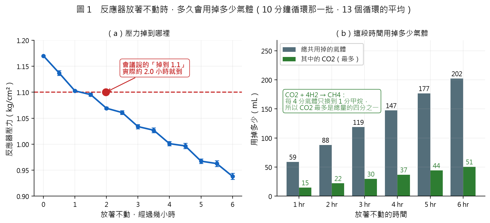
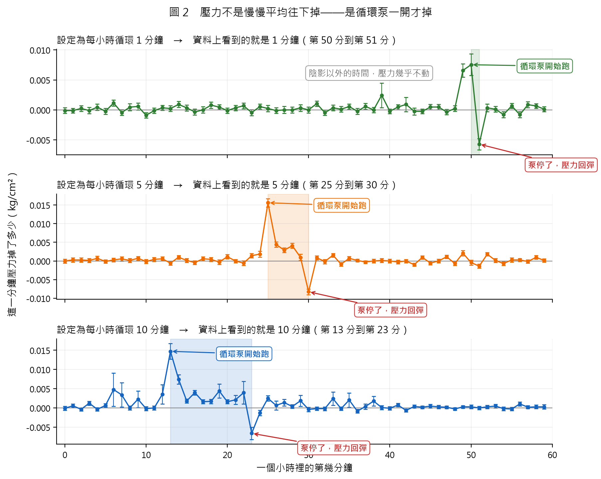
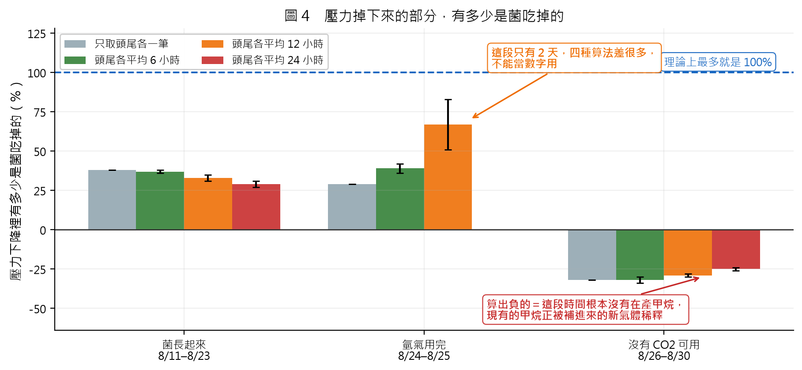
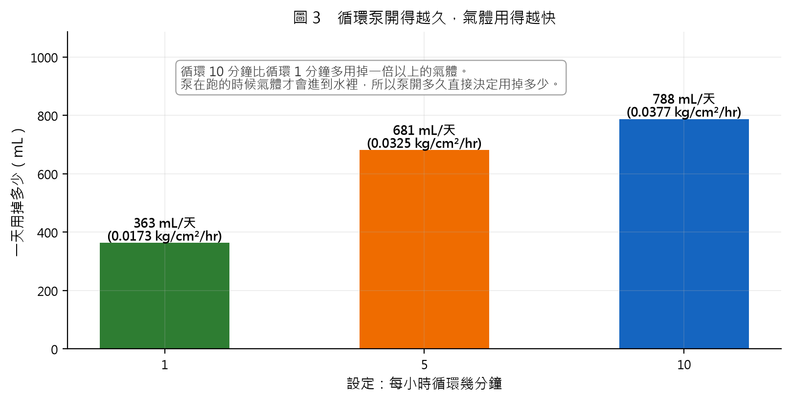

| 國立高雄科技大學_金屬中心_日報（明細表） |  |  |  |
|---|---|---|---|
| 時間 | 2026/09/12 | 學生 | 李承育 |
| 地點 | 金屬中心（全部分析重跑，逐段／逐分鐘／逐日明細） |  |  |

> 本份為同日另一份日報的**明細版**。所有分析重新跑過一次，數字由
> `research/cycles/detail_tables.py` 直接產生，未經手抄。
> 該腳本可重跑：`python detail_tables.py`（或只要某幾張表 `python detail_tables.py A C`）。



*圖 1　會議問「放著不動 1 / 2 / 3 小時各能轉換多少」，這張圖就是答案。左：把 13 個循環對齊平均後，壓力從 1.17 往下掉的樣子；會議說的「掉到 1.1」實際約 2.0 小時就到。右：同樣時間裡總共用掉多少氣體，以及其中最多有多少是二氧化碳（反應式 CO2 + 4H2 → CH4，每 4 分氣體只換到 1 分甲烷，所以 CO2 最多佔四分之一）。*

---

## 目錄

| 表 | 內容 | 回答什麼問題 |
|---|---|---|
| A | τ=10 批次每一段下降的完整明細 | 每個循環各降多少、多久、有多直 |
| B | 循環泵：小時內逐分鐘壓降（三批對照） | 泵什麼時候開、開多久 |
| C | 一個循環裡壓力掉的速度（13 段對齊平均） | 循環裡面掉得快慢怎麼變 |
| D | 自動化批次逐日明細 | 二十天裡每天發生什麼 |
| E | 各階段轉換了多少（四種算法對照） | 轉換了多少、誤差多大 |
| F | 三批對照 | 循環開多久差多少 |

---

## ⚠ 先更正一個先前報告的錯誤

**2026-09-11 週報裡那張逐日表的「當日消耗」欄是錯的。**

該欄先前以「所有負的相鄰壓力差加總」計算，把感測器 ±0.01 的抖動也算成了
消耗，數值被灌水約四倍（報成 2.0 ~ 3.3，實際是 0.42 ~ 0.89）。

證據是它與同一份報告的總量對不起來：舊值加總約 50，但全期總消耗是 13.47。
本份表 D 改用「以補氣為界切段、段首減段尾」計算，**逐日加總正好 13.47**，
與總量一致。

> 受影響的只有該欄。份額、CH4 產量、總消耗等其他數字均以正確方式計算，
> 不受影響。

---

## 表 A　τ=10 批次：每一段下降的完整明細

期間 2026-07-30 至 08-03。本表列出切出的**每一段**，不做篩選。

```
【表 A　τ=10 批次：每一段下降的完整明細】

  #   起始時刻     結束時刻     時長hr  起壓  迄壓  總降   平均速率  斜率    R²     筆數  判定
  -------------------------------------------------------------------------------------------------
  1   07-30 00:00  07-30 04:24  4.4     1.02  0.93  0.090  0.0205    0.0233  0.934  264   ★人工排氣
  2   07-30 04:25  07-30 09:07  4.7     1.16  0.22  0.940  0.1999    0.0349  0.436  283   ★人工排氣
  3   07-30 09:12  07-30 15:15  6.1     1.19  0.92  0.270  0.0446    0.0357  0.980  354   自動循環
  4   07-30 15:16  07-30 21:15  6.0     1.17  0.92  0.250  0.0418    0.0370  0.976  357   自動循環
  5   07-30 21:16  07-31 04:12  6.9     1.16  0.92  0.240  0.0347    0.0351  0.978  413   自動循環
  6   07-31 04:13  07-31 10:13  6.0     1.17  0.92  0.250  0.0416    0.0358  0.979  352   自動循環
  7   07-31 10:14  07-31 16:14  6.0     1.17  0.91  0.260  0.0433    0.0363  0.975  358   自動循環
  8   07-31 16:15  07-31 23:12  7.0     1.19  0.93  0.260  0.0374    0.0344  0.978  412   自動循環
  9   07-31 23:13  08-01 05:21  6.1     1.16  0.92  0.240  0.0392    0.0342  0.976  364   自動循環
  10  08-01 05:22  08-01 12:16  6.9     1.17  0.91  0.260  0.0377    0.0345  0.973  405   自動循環
  11  08-01 12:17  08-01 19:13  6.9     1.17  0.92  0.250  0.0360    0.0320  0.980  408   自動循環
  12  08-01 19:14  08-02 02:22  7.1     1.17  0.92  0.250  0.0351    0.0306  0.978  425   自動循環
  13  08-02 02:24  08-02 10:12  7.8     1.18  0.93  0.250  0.0320    0.0318  0.964  455   自動循環
  14  08-02 10:13  08-02 18:12  8.0     1.17  0.93  0.240  0.0300    0.0278  0.979  472   自動循環
  15  08-02 18:13  08-03 02:13  8.0     1.17  0.91  0.260  0.0325    0.0273  0.977  472   自動循環
  16  08-03 02:14  08-03 04:35  2.4     1.16  1.07  0.090  0.0383    0.0304  0.817  142   ★人工排氣
  17  08-03 04:36  08-03 09:14  4.6     1.08  0.40  0.680  0.1466    0.0324  0.480  279   ★人工排氣
  18  08-03 09:20  08-03 09:24  0.1     0.77  0.18  0.590  8.8500    9.7800  0.924  5     ★人工排氣
  19  08-03 09:40  08-03 13:31  3.9     1.19  1.09  0.100  0.0260    0.0253  0.962  223   ★人工排氣
  -------------------------------------------------------------------------------------------------
  自動循環 13 段：降幅 0.252 ± 0.009　時長 6.83 ± 0.76 hr　速率 0.0374 ± 0.0045 kg/cm²/hr
```

**怎麼看這張表**

- **判定欄**由時長與降幅自動分類，不是人工標註。13 段「自動循環」的
  形狀高度一致；標★的是人工排氣或資料邊界。
- **R²** 是「這段下降有多接近一條直線」。自動循環都在 0.96 以上，人工排氣
  則掉到 0.44 ~ 0.48 —— 兩者形狀差異極大，可據此自動區分。
- 第 18 段是**真正的排氣動作**：5 分鐘內壓力由 0.77 掉到 0.18，
  速率 8.85 kg/cm²/hr，是自動循環的 236 倍。
- 第 1、16、19 段是資料邊界或短殘段，不是完整循環。

**與會議設想的對照**：會議說「1.2 開始下降到 1.1」，實測自動循環是
**1.17 → 0.92，降幅 0.252 ± 0.009**，耗時 6.83 ± 0.76 小時。
降幅是設想的 2.5 倍。若要改成「掉 0.1 就排氣」，依實測速率
0.0374 kg/cm²/hr 推算，節奏約為 **2.7 小時一次**。

---

## 表 B　循環泵：小時內逐分鐘的平均壓降（三批對照）

把每一筆與前一筆的壓力差，依「該筆落在小時內的第幾分鐘」分組平均。
補氣（單步跳升 > 0.03）已排除。

```
【表 B　循環泵：小時內逐分鐘的平均壓降（三批對照）】

  分  tau1 壓降  ±SE     n       tau5 壓降  ±SE     n       tau10 壓降  ±SE     n
  -------------------------------------------------------------------------------------
  00  -0.0001    0.0005  91      +0.0000    0.0005  71      -0.0001     0.0005  105
  01  -0.0001    0.0004  90      +0.0003    0.0006  72      +0.0006     0.0005  107
  02  +0.0002    0.0005  83      +0.0003    0.0006  73      -0.0004     0.0004  109
  03  -0.0001    0.0005  89      +0.0001    0.0006  70      +0.0012     0.0005  106
  04  +0.0005    0.0005  87      +0.0007    0.0006  71      -0.0004     0.0005  109
  05  -0.0002    0.0005  86      -0.0001    0.0005  72      +0.0006     0.0005  108
  06  +0.0011    0.0005  87      +0.0003    0.0005  69      +0.0048     0.0043  109
  07  -0.0004    0.0005  90      +0.0006    0.0006  71      +0.0034     0.0031  106
  08  +0.0005    0.0006  87      +0.0001    0.0005  70      +0.0000     0.0005  103
  09  +0.0006    0.0006  87      +0.0007    0.0005  69      +0.0023     0.0021  106
  10  -0.0009    0.0004  89      -0.0001    0.0005  71      -0.0002     0.0005  107
  11  -0.0001    0.0005  85      +0.0004    0.0005  70      +0.0000     0.0005  105
  12  +0.0004    0.0004  85      +0.0006    0.0005  70      +0.0036     0.0025  107
  13  +0.0002    0.0005  88      -0.0006    0.0005  70      +0.0147     0.0020  104  開
  14  +0.0009    0.0005  88      +0.0010    0.0005  70      +0.0075     0.0012  110  ｜
  15  +0.0003    0.0005  87      +0.0001    0.0006  69      +0.0018     0.0005  105  ｜
  16  -0.0003    0.0005  86      -0.0004    0.0005  69      +0.0040     0.0006  108  ｜
  17  +0.0000    0.0005  86      +0.0006    0.0005  68      +0.0016     0.0005  111  ｜
  18  +0.0008    0.0005  88      +0.0004    0.0005  72      +0.0017     0.0006  105  ｜
  19  +0.0005    0.0004  87      -0.0003    0.0006  68      +0.0044     0.0018  107  ｜
  20  -0.0001    0.0004  88      +0.0011    0.0006  70      +0.0016     0.0005  106  ｜
  21  +0.0003    0.0004  88      +0.0000    0.0004  72      +0.0021     0.0012  109  ｜
  22  +0.0007    0.0005  87      -0.0006    0.0006  70      +0.0040     0.0030  106  ｜
  23  -0.0004    0.0005  89      +0.0014    0.0006  71      -0.0066     0.0016  106  停
  24  +0.0006    0.0005  90      +0.0019    0.0008  70      -0.0013     0.0007  107
  25  +0.0002    0.0005  86      +0.0156    0.0011  66  開  +0.0025     0.0007  108
  26  -0.0001    0.0005  89      +0.0044    0.0007  70  ｜  +0.0007     0.0012  106
  27  +0.0000    0.0006  88      +0.0029    0.0006  69  ｜  +0.0014     0.0009  108
  28  -0.0000    0.0005  88      +0.0041    0.0007  71  ｜  +0.0004     0.0005  107
  29  +0.0003    0.0006  87      +0.0010    0.0008  71  ｜  +0.0019     0.0014  113
  30  +0.0000    0.0005  86      -0.0083    0.0008  69  停  -0.0004     0.0005  106
  31  +0.0010    0.0004  86      +0.0009    0.0005  70      -0.0002     0.0004  109
  32  -0.0005    0.0004  86      -0.0001    0.0006  70      -0.0002     0.0005  107
  33  +0.0003    0.0005  86      +0.0015    0.0005  71      +0.0024     0.0017  108
  34  +0.0001    0.0005  88      -0.0009    0.0005  70      -0.0002     0.0004  107
  35  +0.0006    0.0005  90      +0.0007    0.0005  71      +0.0020     0.0019  108
  36  -0.0002    0.0005  89      +0.0001    0.0004  69      -0.0008     0.0005  106
  37  +0.0006    0.0005  86      -0.0003    0.0004  70      +0.0004     0.0007  107
  38  +0.0000    0.0004  90      +0.0000    0.0005  69      +0.0018     0.0013  107
  39  +0.0024    0.0020  90      +0.0001    0.0006  70      +0.0001     0.0005  106
  40  -0.0002    0.0004  89      +0.0000    0.0005  70      -0.0001     0.0005  108
  41  +0.0005    0.0004  85      -0.0003    0.0005  73      +0.0007     0.0004  107
  42  +0.0009    0.0012  87      +0.0000    0.0004  72      -0.0006     0.0004  109
  43  -0.0002    0.0006  85      -0.0010    0.0004  70      +0.0004     0.0004  107
  44  -0.0002    0.0004  82      +0.0010    0.0004  72      +0.0002     0.0004  105
  45  +0.0005    0.0004  84      -0.0006    0.0005  71      +0.0005     0.0004  105
  46  +0.0005    0.0004  84      -0.0000    0.0005  71      +0.0003     0.0004  108
  47  -0.0004    0.0005  85      +0.0011    0.0005  71      +0.0002     0.0003  106
  48  +0.0002    0.0005  85      -0.0007    0.0005  72      -0.0003     0.0004  107
  49  +0.0066    0.0011  82      +0.0021    0.0007  72      +0.0003     0.0003  105
  50  +0.0075    0.0018  81  開  -0.0004    0.0007  70      +0.0003     0.0004  103
  51  -0.0057    0.0009  84  停  -0.0014    0.0006  73      -0.0000     0.0004  104
  52  +0.0003    0.0006  87      +0.0018    0.0005  72      +0.0003     0.0004  104
  53  +0.0001    0.0005  88      +0.0001    0.0005  72      +0.0005     0.0005  103
  54  -0.0008    0.0005  89      -0.0007    0.0005  72      -0.0002     0.0005  107
  55  +0.0007    0.0004  89      +0.0003    0.0006  72      -0.0003     0.0004  107
  56  -0.0008    0.0005  87      +0.0003    0.0004  72      +0.0010     0.0005  106
  57  +0.0009    0.0005  92      -0.0001    0.0005  71      +0.0002     0.0004  107
  58  +0.0007    0.0004  90      +0.0010    0.0005  72      +0.0003     0.0005  108
  59  +0.0001    0.0004  88      +0.0001    0.0004  72      +0.0003     0.0006  106
  -------------------------------------------------------------------------------------
  tau1（設定每小時循環 1 分）泵在第 50~51 分跑＝1 分鐘；這段佔全部壓降的 37%；泵開 0.4519 vs 泵停 0.0133＝34 倍
  tau5（設定每小時循環 5 分）泵在第 25~30 分跑＝5 分鐘；這段佔全部壓降的 85%；泵開 0.3360 vs 泵停 0.0055＝62 倍
  tau10（設定每小時循環 10 分）泵在第 13~23 分跑＝10 分鐘；這段佔全部壓降的 65%；泵開 0.2602 vs 泵停 0.0277＝9 倍
```



*圖 2　壓力不是整個小時慢慢平均往下掉，而是循環泵一開才掉。三批設定的每小時循環時間是 1、5、10 分鐘，資料上量到的長度就正好是 1、5、10 分鐘（陰影處）。陰影以外壓力幾乎不動。這代表氣體是在泵運轉時才進到水裡，泵開多久直接決定用掉多少。*

**怎麼看這張表**

- 三批**泵開始跑的時刻不同**（第 50、25、13 分），但**開的長度分別是 1、5、10 分**，
  與各批宣稱的 τ 完全一致。τ 的定義就是每小時循環幾分鐘。
- 泵一開的那一分鐘壓力**猛掉**（氣體大量進到水裡）；
  泵一停的那一分鐘壓力**回彈**。
- 泵沒在跑的分鐘，壓力變化幾乎都在 ±0.001 以內，跟誤差同一個量級 —— 也就是
  **不運轉時壓力幾乎不動**。
- tau5 的對比最極端：泵只佔每小時的 8.3% 時間，卻造成 **85%** 的壓降。

---

## 表 C　一個循環裡面，壓力掉的速度怎麼變（13 段對齊後平均）

把 13 個自動循環按「循環開始後經過幾小時」對齊再平均，每 30 分鐘一格。
平均之後誤差只剩 0.002 ~ 0.006，單看一個循環看不出來的東西就顯出來了。

```
【表 C　一個循環裡壓力掉的速度（13 段對齊後平均，每 30 分一格）】

  循環內時刻 hr  平均累計壓降  標準誤  區間速率  相對速率
  -------------------------------------------------------
  0.0            +0.0000       0.0000
  0.5            -0.0331       0.0047  0.0662    1.71×
  1.0            -0.0675       0.0017  0.0687    1.78×
  1.5            -0.0746       0.0031  0.0143    0.37×
  2.0            -0.1009       0.0023  0.0525    1.36×
  2.5            -0.1092       0.0038  0.0167    0.43×
  3.0            -0.1362       0.0041  0.0539    1.39×
  3.5            -0.1432       0.0048  0.0141    0.36×
  4.0            -0.1690       0.0042  0.0516    1.33×
  4.5            -0.1734       0.0051  0.0088    0.23×
  5.0            -0.2027       0.0043  0.0586    1.52×
  5.5            -0.2074       0.0058  0.0093    0.24×
  6.0            -0.2319       0.0059  0.0492    1.27×
  -------------------------------------------------------
  n = 13 段；全段平均速率 0.0387 kg/cm²/hr
```

（本表與前面的圖 1 是同一批資料：圖 1 左邊那條線就是這張表畫出來的樣子。）

**怎麼看這張表**

「相對速率」欄是該 30 分鐘的速率除以全段平均。數值**明顯交替**：
1.71×、1.78×、0.37×、1.36×、0.43×、1.39×、0.36× ⋯⋯

這就是表 B 那個泵的節奏：有泵在跑的那半小時掉得快，沒泵的那半小時掉得慢。
**一個循環裡面，壓力不是等速往下掉的。**

---

## 表 D　自動化批次：逐日明細（08-11 ~ 08-31）

```
【表 D　自動化批次：逐日明細（2026-08-11 ~ 08-31）】

  日期        筆數  覆蓋  壓力 min~max  CH4中位  日變化  CO2中位  補氣  當日消耗  備註
  -----------------------------------------------------------------------------------------
  2026-08-11  1406  98%   0.92~1.20     9.99             4.20     13    0.890     建立期
  2026-08-12  1386  96%   1.11~1.20     20.16    +10.2   3.50     13    0.830     建立期
  2026-08-13  1399  97%   1.11~1.20     24.22    +4.1    3.50     13    0.740     建立期
  2026-08-14  1404  98%   1.11~1.20     27.31    +3.1    3.20     11    0.630     建立期
  2026-08-15  1387  96%   1.12~1.20     30.65    +3.3    3.30     12    0.600     建立期
  2026-08-16  1369  95%   1.12~1.20     32.67    +2.0    2.90     12    0.590     建立期
  2026-08-17  1418  98%   1.12~1.20     34.58    +1.9    2.50     13    0.640     建立期
  2026-08-18  1397  97%   1.11~1.20     35.96    +1.4    2.10     12    0.630     建立期
  2026-08-19  1395  97%   1.12~1.20     36.83    +0.9    1.70     12    0.690     建立期
  2026-08-20  1421  99%   1.11~1.20     37.56    +0.7    1.40     12    0.630     建立期
  2026-08-21  1423  99%   1.11~1.20     38.54    +1.0    1.00     12    0.690     建立期
  2026-08-22  1416  98%   1.10~1.20     39.33    +0.8    0.60     12    0.710     建立期
  2026-08-23  1411  98%   1.04~1.20     39.61    +0.3    0.30     12    0.710     建立期
  2026-08-24  1415  98%   0.69~1.20     23.01    -16.6   0.10     1     0.580     ★氫氣耗盡
  2026-08-25  1385  96%   0.55~1.19     39.38    +16.4   0.00     8     0.560     ★氫氣耗盡
  2026-08-26  1407  98%   1.10~1.20     42.63    +3.2    0.00     12    0.750     衰退期
  2026-08-27  1392  97%   1.11~1.20     41.00    -1.6    0.00     12    0.670     衰退期
  2026-08-28  1403  97%   1.11~1.20     39.25    -1.8    0.00     12    0.710     衰退期
  2026-08-29  1428  99%   1.11~1.20     37.61    -1.6    0.00     11    0.620     衰退期
  2026-08-30  1428  99%   1.11~1.20     34.03    -3.6    0.00     6     0.420     衰退期
  2026-08-31  540   38%   1.11~1.20     31.27    -2.8    0.00     2     0.180     ★覆蓋不足
  -----------------------------------------------------------------------------------------
  當日消耗欄加總 = 13.47 kg/cm²，與全期總消耗一致。⚠ 2026-09-11 週報該欄用「所有負差加總」計算，把 ±0.01 的感測器抖動也算進去，灌水約四倍。
```

**怎麼看這張表**

- **建立期（8/11 ~ 8/23）**：甲烷逐日上升，日增幅由 +10.2 收斂到 +0.3，
  是典型的快要飽和；二氧化碳同步由 4.20% 一路降到 0.30%。
- **8/24 ~ 8/25 氫氣耗盡**：8/24 當日只補氣 **1 次**（平時 11 ~ 13 次），
  壓力掉到 0.69，甲烷跌 16.6 個百分點。與現場照片吻合。
- **衰退期（8/26 起）**：二氧化碳維持 **0.00%**，甲烷由 42.63% 一路降到
  31.27%，每日補氣次數與消耗量同步下滑。
- **8/31 覆蓋率僅 38%**，該日數值不宜單獨引用。
- 「當日消耗」欄加總為 **13.47**，與全期總消耗一致（見前述更正）。

---

## 表 E　各階段轉換了多少（四種算法對照）

```
【表 E　各階段轉換了多少（四種算法對照）】

  期間                天數  總消耗  CH4 起→迄    怎麼算        CH4 產量          生物份額    mL/天
  --------------------------------------------------------------------------------------------------------
  建立期 8/11–8/23    13.0  8.95    0.7%→39.4%   單筆端點      +0.8522           +38%        57
                                                 兩端各 6 hr   +0.8171 ± 0.0168  +37% ± 1%   55     ← 建議
                                                 兩端各 12 hr  +0.7474 ± 0.0471  +33% ± 2%   50
                                                 兩端各 24 hr  +0.6460 ± 0.0352  +29% ± 2%   43
  氫氣耗盡 8/24–8/25  2.0   1.03    39.3%→42.7%  單筆端點      +0.0740           +29%        32
                                                 兩端各 6 hr   +0.1000 ± 0.0076  +39% ± 3%   44     ← 建議
                                                 兩端各 12 hr  +0.1714 ± 0.0423  +67% ± 16%  75
  衰退期 8/26–8/30    5.0   3.10    42.8%→31.3%  單筆端點      -0.2493           -32%        -43
                                                 兩端各 6 hr   -0.2495 ± 0.0137  -32% ± 2%   -43    ← 建議
                                                 兩端各 12 hr  -0.2271 ± 0.0109  -29% ± 1%   -40
                                                 兩端各 24 hr  -0.1928 ± 0.0089  -25% ± 1%   -34
  --------------------------------------------------------------------------------------------------------
  化學計量上限 CH4/消耗 ≤ 0.25（生物份額 ≤ 100%）。⚠ 份額為負代表該期間沒有甲烷在產生，現有的正被補入氣體稀釋。⚠ 氫氣用完那段只有 2 天，四種算法差很多，不要引用。
```



*圖 4　壓力掉下來的部分，有多少是菌吃掉變成甲烷的。同一段資料用四種不同算法都會得到差不多的答案（菌長起來那段 29 ~ 38%），表示這個數字站得住。氫氣用完那段只有 2 天，四種算法差很多，不能當數字用。沒有 CO2 可用那段全部是負的——負的代表根本沒在產甲烷，反應器裡原有的甲烷正被補進來的新氣體稀釋。*

**怎麼看這張表**

甲烷濃度不是照直線在漲，是**前面漲得快、後面越來越慢**。所以「頭尾各取
幾筆來算」會影響答案：

- **只取頭尾各一筆**：最省事，但給不出誤差範圍。
- **頭尾各平均 6 小時**（建議）：足夠把雜訊平均掉，又不會取太寬。
- **頭尾各平均 12 / 24 小時**：尾端取得越寬，就把還在往上漲的那段也平均進去，
  算出來會偏小。

⚠ **氫氣用完那段只有 2 天，四種算法差到 +29% / +39% / +67%**，
該段的數字不要引用。

---

## 表 F　三批對照：每小時循環幾分鐘，差多少

```
【表 F　三批對照：每小時循環幾分鐘，差多少】

  批次   τ分  期間         天數  段數  降幅中位  時長中位  速率中位  泵在跑          佔壓降  CH4峰
  ------------------------------------------------------------------------------------------------
  tau1   1    07/22~07/26  5.0   9     0.170     11.16     0.0173    50–51（1 分）   37%     1
  tau5   5    07/27~07/29  3.0   11    0.240     6.96      0.0325    25–30（5 分）   85%     0
  tau10  10   07/30~08/03  5.0   19    0.250     6.05      0.0377    13–23（10 分）  65%     2
  ------------------------------------------------------------------------------------------------
  「泵在跑」＝壓力猛掉那一分鐘到回彈那一分鐘，其長度應該等於設定的每小時循環分鐘數。⚠ CH4 峰欄顯示可用的濃度錨點極少，三批合計僅 3 個。
```



*圖 3　循環泵開得越久，氣體用得越快：每小時循環 1 分鐘一天用掉 363 mL，5 分鐘 681 mL，10 分鐘 788 mL。這是可以直接拿來排運轉條件的數字。*

**怎麼看這張表**

循環開得越久，壓力掉得越快：0.0173 → 0.0325 → 0.0377 kg/cm²/hr，
泵開的長度同步是 1 → 5 → 10 分鐘。兩者一起變，說明了道理很單純：
**泵跑多久，氣體就跟水接觸多久。**

⚠ **CH4 峰欄**顯示可用的濃度錨點極少：tau1 只有 1 個、tau5 **一個都沒有**、
tau10 有 2 個。沒有錨點就無法做化學計量歸因 —— 這是目前最大的限制。

---

## 綜合判讀

**1. 自動循環的一致性很高。** 13 段的降幅標準差只有 0.009（佔均值 3.6%），
時長標準差 0.76 小時。設備運轉穩定，資料品質足以支撐分析。

**2. 壓力是泵在跑的時候才掉的，不是整個小時平均掉。** 泵只佔每小時的
1.7 ~ 17% 時間，卻造成 37 ~ 85% 的壓降。這對論文有影響：我們擬合的那條
平滑曲線其實是**一連串脈衝的外框**，不是底層真正的變化過程。

**3. 濃度錨點不足仍是主要瓶頸。** 三批合計只有 3 個 CH4 峰值。會議規劃的
「3 ~ 4 小時排一次氣」正是為了解決這一點。

---

## 待辦事項

1. **確認二氧化碳供應狀況**（延續前報，仍為最優先）。自 8/23 起頭空
   二氧化碳為 0.00%，8/26 之後甲烷持續下降。

2. **排氣期間記錄頻率提高到每 10 秒**。實測排氣只橫跨 3 ~ 4 筆資料。

3. **更正週報的逐日消耗欄**（本報告已列出正確值）。

4. 論文的模型假設段落要補一句：所擬合的平滑曲線是一連串脈衝的外框。

## 待確認事項

1. 循環泵開始跑的時刻三批各不相同（第 50、25、13 分）。這是控制程式設定的，
   或由開機時刻決定？若為後者，該時刻應併入實驗紀錄。

2. tau5 批次期間**完全沒有可用的 CH4 濃度峰值**，是否該期間未曾排氣？

3. 延續前報：資料夾標示之「補氣 0.15 / 0.2 kg」對應之量測值；
   8/31 覆蓋率 38% 之資料是否可用。

## 附註

- 分析腳本：`research/cycles/detail_tables.py`（本報告全部表格）、
  `research/cycles/pump_rhythm.py`（循環泵的節奏）、
  `research/cycles/hourly_resolution.py`（小時尺度量得到量不到的界線）
- 壓力單位皆為 kg/cm²（錶壓）；絕對壓 = 錶壓 + 1.033
- 體積換算以頭空 1.00 L、30 °C 計。⚠ 溫度欄全期恆為 30.00，非實測值
