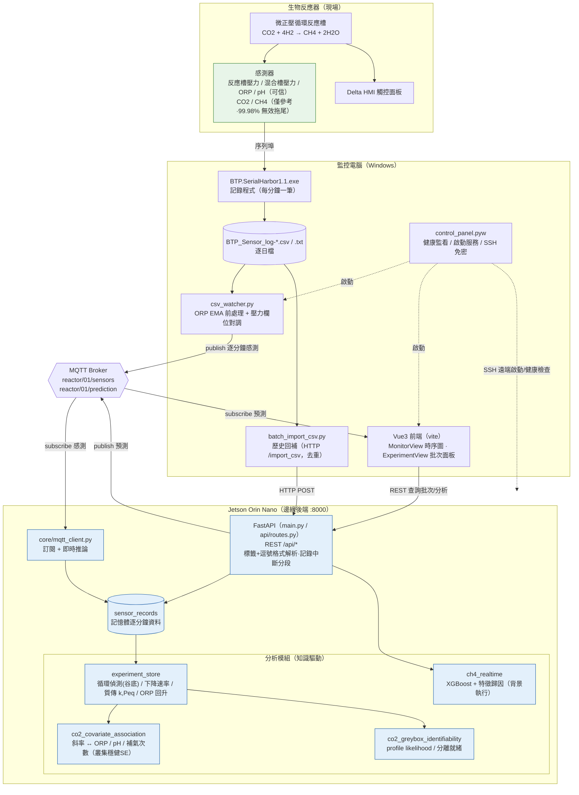

# 系統架構圖（draw.io / mermaid）2026-07-27

## 匯入方式（draw.io）
1. 開 [app.diagrams.net](https://app.diagrams.net)
2. 功能表 **Arrange（排列）→ Insert（插入）→ Advanced（進階）→ Mermaid…**
3. 貼下方整段 mermaid 程式碼 → **Insert** → 自動生成可編輯圖形

> 部署對應實際情況：**後端跑在 Jetson（192.168.55.1:8000）**，監控電腦只跑記錄程式、CSV 監看與網頁前端。

## 圖中要點（給看圖的人）
- **可信訊號**（綠）：反應槽壓力、混合槽壓力、ORP、pH；CO2/CH4 僅參考。
- **邊緣運算**（藍）：推論與分析都在 Jetson 上，非雲端。
- **兩條資料路徑**：即時（csv_watcher → MQTT → Jetson）＋ 歷史回補（batch_import_csv → HTTP）。
- **控制台** control_panel.pyw 以虛線表示「編排/監看」而非資料流。
