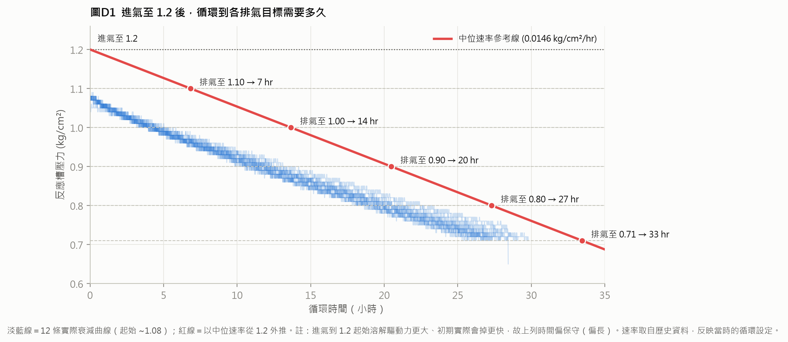
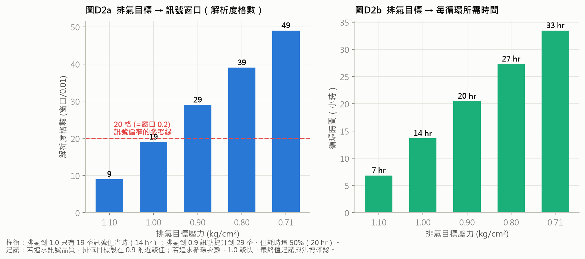
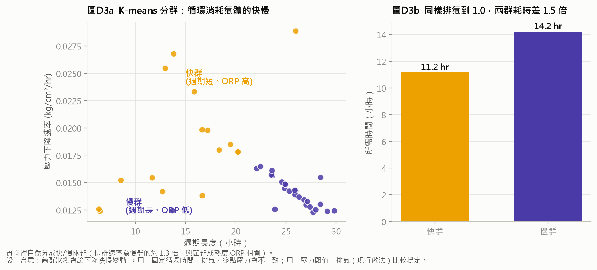

# 循環時間與排氣壓力設計說明

報告人：李承育　　日期：2026-07-17
用途：向洪博報告新實驗（進氣 1.2 → 循環 n 分鐘 → 排氣）的兩個設計決策，附歷史資料統計佐證。

---

## 一、兩個要決定的參數

新實驗流程：**進氣至 1.2 kg/cm² → 每小時循環 n 分鐘 → 壓力掉到目標值就排氣 → 重複**。

需要決定：

1. **循環總時間要多久**（＝壓力從 1.2 掉到排氣目標的時間）
2. **排氣目標壓力設多少**（現行想設 1.0，但 1.0 很接近進氣的 1.2，窗口是否太窄）

以下用歷史資料（0301-0416，5 分鐘循環那批）的實測壓力下降速率來估算。

---

## 二、循環總時間 → 由壓力下降速率換算

實測壓力下降速率中位數 **0.0146 kg/cm²/hr**（已排除異常批次）。從進氣 1.2 掉到各排氣目標所需時間：

| 排氣目標壓力 | 壓力窗口 | 循環時間（中位） |
|---|---|---|
| 1.0 | 0.20 | **約 14 小時** |
| 0.9 | 0.30 | 約 20 小時 |
| 0.8 | 0.40 | 約 27 小時 |
| 0.71 | 0.49 | 約 33 小時 |

> 圖D1：淡藍線為 12 條實際壓力衰減曲線（起始 ~1.08），紅線為以中位速率從 1.2 外推。
> 兩者吻合，且實際初期掉得略快 → 上表時間偏保守（實際可能略短）。

---

## 三、排氣目標壓力 → 訊號窗口 vs 時間 的權衡

排氣目標越低，可觀測的壓力窗口越大（訊號越好），但每次循環耗時越長。

| 排氣目標 | 訊號窗口（解析度格數） | 每循環時間 | 評估 |
|---|---|---|---|
| 1.0 | 19 格 | 14 hr | 窗口偏窄（壓力解析度 0.01，只有 19 格） |
| **0.9** | **29 格** | **20 hr** | **訊號明顯改善，時間可接受** |
| 0.8 | 39 格 | 27 hr | 訊號更好但耗時長 |

**初步建議**：排氣目標從 1.0 往下設到 **0.9 附近**，訊號窗口從 19 格提升到 29 格，較能支撐後續的壓力/pH/ORP 斜率分析；代價是每循環多約 6 小時。**最終值請洪博裁示。**

---

## 四、一個重要觀察：菌群狀態會讓下降快慢變動（K-means 分群）

把歷史循環依「消耗氣體的快慢」分群（不區分溶解或生物消耗），資料自然分成快、慢兩群，速率差約 1.3 倍，且與菌群成熟度（ORP）相關。

**設計含意**：既然下降快慢會隨菌群狀態變動，若採「固定循環時間」排氣，終點壓力會不一致；**採「壓力閾值」排氣（現行做法）比較穩定**。→ 支持現行的壓力閾值設計。

---

## 五、請洪博裁示 / 討論

| # | 事項 | 初步建議 |
|---|---|---|
| 1 | 排氣目標壓力設多少？ | 建議 0.9（訊號 vs 時間權衡） |
| 2 | 循環時間 n（每時幾分）水準 | 先做 1 / 5 / 10 分（見另附參數表） |
| 3 | 進氣壓力 1.2 是否合適？ | 沿用先前討論值，待確認 |
| 4 | 每個條件重複次數 | 建議至少 3 次（訊號變異需要重複才能分辨） |

（實驗參數與批次排程另見：`實驗參數與批次表_2026-07-17.xlsx`）
